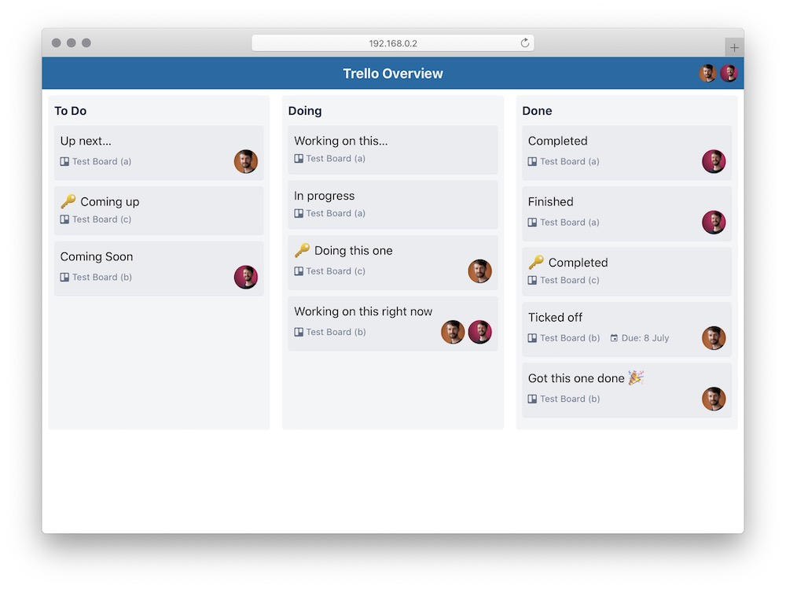

# Trello Overview

Do you have that problem of having a multiple team members on multiple projects over multiple Trello boards? Yup, me too.

Trello Overview is a simple tool to give you a quick overview of what your team is working on right now. Give it boards you want it to keep an eye on, and the lists to pull cards from and it will merge the lists into one virtual board.

[See a live demo](https://trello-overview.netlify.app/)

Nb: This isn't meant to replace Trello UI, instead just a quick overview of what is happening across multiple boards.



## In the box

- [11ty](https://www.11ty.dev/)
- [Laravel Mix](https://laravel-mix.com/)
- [Tailwind](https://tailwindcss.com/)
- [AlpineJS](https://github.com/alpinejs/alpine)

## Development

1. `npm install`
2. Update `config.js` with the `trelloBoardIds` and the `trelloLists` to pull in.
3. If pulling in from private boards create a `.env` file (see below).
4. `npm run watch`

### A note about prviate boards…

To access data from private Trello boards you'll need an [API key and token](https://trello.com/app-key):

1. [Request an API key and token from Trello](https://trello.com/app-key). The key will be displayed right on that page, you'll need to click the link titled _'manually generate a Token'_ to get your token
2. `cp example.env .env`
3. Fill out the `.env` file with the correct key and token:

```
TRELLO_API_KEY=##YOURKEYHERE##
TRELLO_API_TOKEN=##YOURETOKENHERE##
```

Don't commit that file to the repo.

This should be obvious, but… this project will pull in the cards from your private boards and merge them onto a page. If you're working on a top secret project you might want to make this only accessible internally… or from behind a password… or something like that.

_Public Trello boards are public via the API, so if you're only accessing public boards you won't need to do this._

## Production

1. `npm run production`

## To do…

- [x] Import private boards
- [ ] Laravel Mix assets get version query strings
- [x] Team member filter
- [x] Board filter
- [x] SVG icons
- [x] Favicon
- [ ] Team member swimlane
- [ ] Board swimlane
- [x] Netlify demo board
- [ ] Improved filters (eg filter by board AND person)
- [x] Improved layout for mobile and for more than 3 lists
