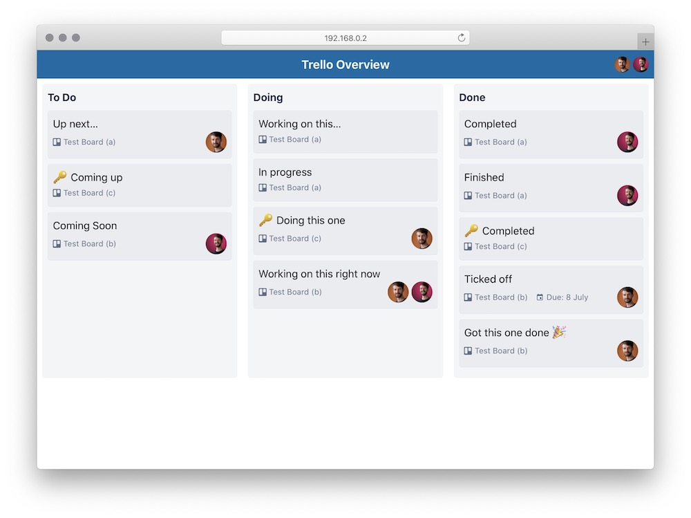

## What is this overview thing?

Do you have that problem of having a multiple team members on multiple projects over multiple Trello boards? Yup, me too.

Trello Overview is a simple tool to give you a quick overview of what your team is working on right now. Feed the IDs of boards you want it to keep an eye on, and the lists to pull cards from, and it will merge the lists into one virtual board.

[See a live demo](https://trello-overview.netlify.app/)

## What this is not…

This is intentionally not trying to clone all the functionality of a Trello board into one mega board. You'll find no means of updating cards here, or moving them between lists. Trello does a great job of that. Instead this is more of a top-level dashboard for teams.

## Get started…

1. Clone the project
2. Update the config.js
3. Deploy to your preferred host (Netlify is easy)

## Coming soon (maybe)

[x] Import private boards  
[x] Team member filter  
[x] Board filter  
[ ] Team member swimlane  
[ ] Board swimlane  
[x] Improved filters (eg filter by board AND person)  
[x] Improved layout for mobile and for more than 3 lists
